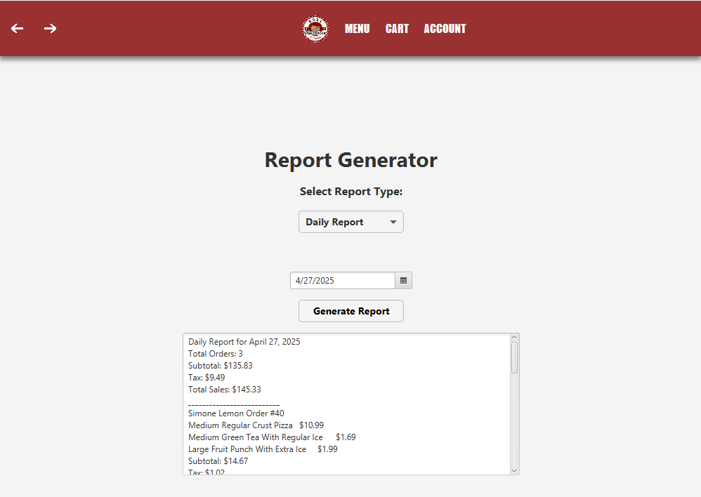

# Pizza Shop System (Team Project)

A JavaFX-based pizza shop application built as a collaborative academic project.  
This repository is preserved as a portfolio artifact, demonstrating backend logic,
application state management, and interactive UI workflows in a multi-screen
desktop application.

My contributions focused primarily on backend order processing, application state
correctness, and dynamic UI integration (including complex UI workflows such as the pizza customization screen).

This was my first large-scale, multi-screen application project and is preserved
as a portfolio artifact to illustrate early experience with backend logic,
application state management, and system-level debugging.

---

## Tech Stack
- Java
- JavaFX (FXML)
- Maven
- org.json (local file-based persistence)

---

## Key Features
- User authentication (login/signup) and account management
- Menu browsing and item customization (pizza and beverages)
- Dynamic pizza customization with real-time pricing updates
- Cart and checkout workflow with order finalization
- JSON-based persistence for users, menu items, and orders
- Reporting features (daily and weekly summaries and receipts)

---

## Architecture Overview

### Backend / Service Layer
- OrderService  
  Manages the order lifecycle, including creating the active order, adding and
  updating items, calculating totals (subtotal, tax, total), and finalizing checkout.

- AccountService  
  Handles user account operations and active user state.

- ReportGenerator  
  Aggregates persisted order data to generate daily and weekly reports.
  I was responsible for the design and implementation of this component,
  including data aggregation logic and edge-case handling.

  

  Example of the reporting interface backed by aggregate order data

### UI Layer
- JavaFX controllers manage user interaction across multiple screens
- FXML files define layouts, with CSS used for styling
- Controllers communicate with service-layer logic to keep UI and data synchronized

### Persistence
- JSON files store menu items, customization options, users, and orders
- Data is read and written at runtime to simulate a simple backend data store

---

## Personal Contributions
### Backend Logic and UI Integration

This repository is preserved as a legacy team project. My primary contributions
focused on backend logic, application state management, and correctness, with
additional work on UI components requiring close service integration.

Backend and State Management:
- Implemented and debugged order lifecycle logic using a service-based design
  (creating current orders, adding, updating, and removing items, and finalizing checkout).
- Fixed state-related bugs where cart and order data became inconsistent across
  JavaFX screen navigation.
- Built dynamic pricing logic driven by JSON configuration files (pizza size,
  crust, toppings, beverage options).
- Ensured accurate subtotal, tax, and total calculations throughout the order flow.
- Worked on JSON-based persistence and handled edge cases such as empty or
  duplicated orders.
- Integrated reporting output into the broader application workflow and UI.

UI and Controller Work:
- Designed and implemented interactive JavaFX screens, including the Customize
  Pizza workflow with real-time price updates.
- Integrated UI controllers with backend services to ensure cart contents and
  order totals stayed synchronized across screens.
- Debugged UI-to-service interactions where screen transitions exposed hidden
  state bugs.

This work closely mirrors real-world full-stack challenges, where UI-driven
workflows must remain consistent with backend business rules.

---

## How to Run

### Requirements
- Java 17 or newer
- Maven

### Run the Application
```bash
mvn clean javafx:run

